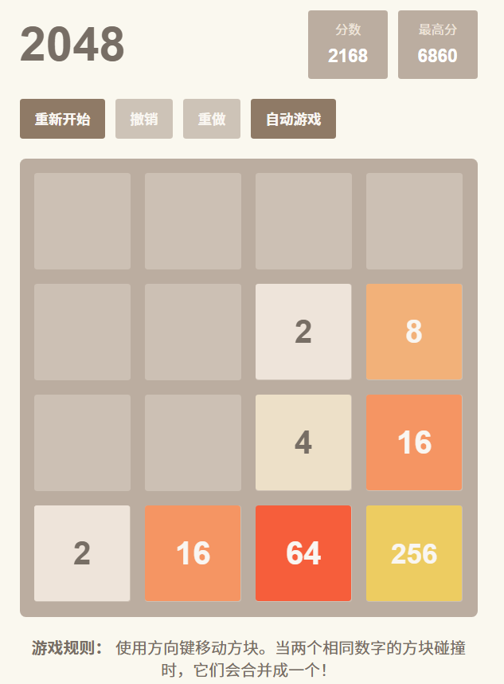

# 用AI 30分钟做出2048小游戏 | 0代码小白也能搞定！

## 我的AI开发2048小游戏全过程

1. **用Kiro自动生成文档**
   - 只需一句话，Kiro就帮我生成了3个文件：
     - **requirements.md**：用户故事、功能需求
     - **design.md**：整体架构、每个模块怎么分工
     - **tasks.md**：分阶段任务清单，每个阶段拆成小任务
   - 这些文档完全不用自己写，AI全自动！

2. **遇到Kiro小bug，切换Cursor继续开发**
   - Kiro写文档很强，但写代码时经常报错（很多人都遇到）
   - 所以我用Cursor（另一个AI开发工具）来写代码
   - 只要把Kiro生成的3个文档拖进Cursor，告诉AI“先做phase1”，它就会自动写好所有核心代码

3. **AI写完，直接本地体验**
   - 打开终端输入：`python -m http.server 8000`
   - 浏览器访问 [http://localhost:8000](http://localhost:8000)
   - 用方向键就能玩2048啦！

4. **发现bug，直接和AI说**
   - 比如我发现合成大数字后会消失，直接告诉AI哪里有问题
   - AI会自动分析、修复，再给我一版新代码
   - 再比如方块显示不对齐，也只要一句话，AI立刻修好

5. **反复体验+对话，半小时搞定**
   - 全程不用自己写一行代码
   - 只要和AI对话、体验、反馈bug，AI就能帮我一步步完善
   - 最后小游戏功能齐全，体验流畅，超有成就感！

---

## 总结

- **AI开发真的很简单**：只要会描述需求，剩下的交给AI
- **文档自动生成**，代码自动实现，bug自动修复
- **0基础也能做出自己的小游戏**，而且效率超高！

---

想试试AI开发？  
只需三步：  
1. 让Kiro写文档  
2. 用Cursor让AI写代码  
3. 浏览器打开就能玩！

（唯一的“技术难点”就是在浏览器输入网址😄）

---

**#AI开发 #零基础编程 #2048小游戏 #效率神器 #小红书成长记录**